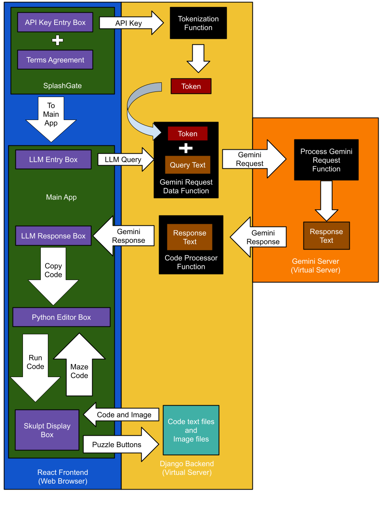
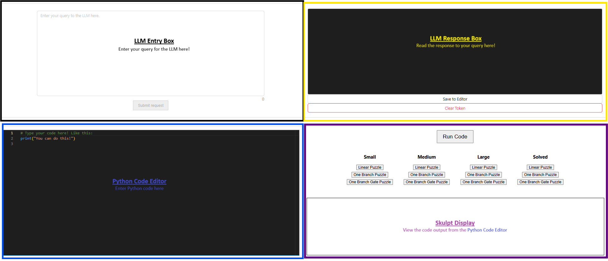
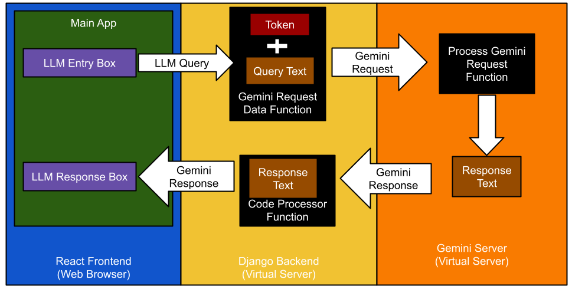
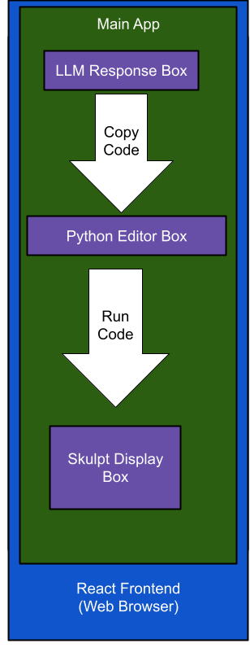
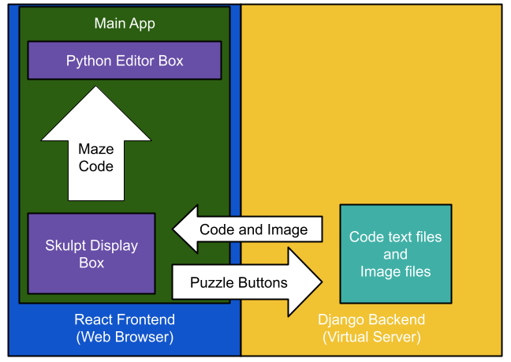
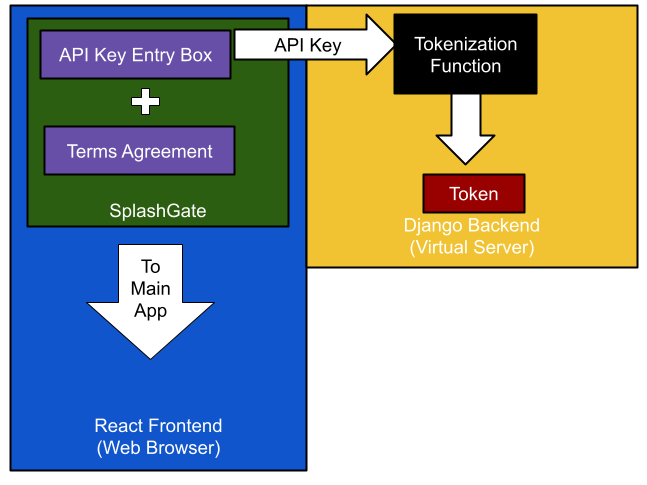

# LLM-Web-App
This educational tool supports students from 6th grade and up by demonstrating the benefits, drawbacks, and ethical considerations involved in using large language models (LLMs). It is strictly for educational use, specifically as a demonstration of AI's capabilities. This app is deployed via Render and can be viewed here [https://llm-web-app-4970.onrender.com/](https://llm-web-app-4970.onrender.com/)

## Table of Contents
1. [Description](#description)
    * [Language and Library Rationale](#language-and-library-rationale)
    * [React Frontend Orientation](#react-frontend-orientation)
    * [Django Backend Orientation](#django-backend-orientation)
2. [Installation](#installation)
5. [License](#license)
6. [Contributing](#contributing)
7. [Tests](#tests)
8. [Questions](#questions)

## Description
### Language and Library Rationale
This particular application has several moving parts to its operation. We will begin with its base structure: a React page written in TypeScript. I chose to use React as it is a modern framework that is well-supported with documentation and numerous libraries. React is written in JavaScript and its variations, such as TypeScript in this case, allowing for an app that is easy to update as the state variables changed. React also allows the app to be scalable and device-responsive without a heavy reliance on Cascading Style Sheets (CSS). Documentation on React and how it works can be found here: [https://react.dev/](https://react.dev/).

The app is written in TypeScript as a way for me to impose strict typing requirements on JavaScript - a non-type safe language. TypeScript requires every variable declaration to have an associated type, much like Java or C-based languages require type prefixes. This allows me to catch variable type conflicts prior to running and deployment, resulting in more intentional code design. More on TypeScript can be found here: [https://www.typescriptlang.org/](https://www.typescriptlang.org/).

The app utilizes Google's Gemini API to send queries to and receive replies from Gemini. The app needed access to some style of LLM and Gemini was chosen due to its easy access to a free-tier operations. There are numerous models of Gemini, each with their own limits in terms of character count and number of requests per day, so the app will change which model it queries depending on model availability and if its limits are exceeded. The Gemini API documentation can be found here: [https://ai.google.dev/gemini-api/docs](https://ai.google.dev/gemini-api/docs)

Due to its reliance on Gemini, the app requires the user to have a valid Gemini API key. These can be gotten free of charge here: [https://makersuite.google.com/app/apikey](https://makersuite.google.com/app/apikey)  

The app also needs to allow the user to write and execute code in Python. This is done through the use of the Monaco Editor [https://microsoft.github.io/monaco-editor/](https://microsoft.github.io/monaco-editor/) and a Skulpt Display [https://skulpt.org/](https://skulpt.org/). Monaco is a module that creates editor objects in React that serves as an IDE-like text environment, making it user-friendly. Skulpt is a module that compiles Python into JavaScript, thus converting the inputted Python code into a Javascript form that can be run in the web browser.

A macro view of the interactions of this app can be seen in this diagram:

### React Frontend Orientation
The first page of the app is a "splashgate" that prevents users from interacting with the main page until two pieces of data are collected. 

Firstly, the terms and conditions of the app must be agreed to. This app is meant for educational use only, with the intention that the educators will use it as a demonstration for their class to be guided through. Currently, many LLMs require users to be 18 or older. As a result, the user needs to agree that they meet and will follow the Gemini agreement criteria, or they cannot use the app.

Secondly, any interaction with an LLM in this app requires an API key. This API key is also required for access beyond the splashgate. This key is not as required as the agreement to the terms and conditions, since a non-functional key will result in an LLM return error - so access to the LLM would still be barred. **Please Note - ** The API key is tokenized by the Django server and cached in the browser. The API key is hidden via the token, but will only be cleared after 1 hour or when the user manually clears their browser cache.

Once beyond the splashgate, the main App has four sections as seen in this diagram:

The "LLM Entry Box" is where you can type your query that will be sent to some version of Gemini. Your query can be structured in any form of text, but must be text as there is no way to submit any other medium via the app. The "Submit request" button will take the text entered in the box and send it to the Django backend server. The Django server will then retrieve the user's API key with the user's token, then forwards that API key and the submitted text to the Gemini LLM. 

Once the LLM responds to the Django server, that response is then forwarded to the React frontend. Assuming the response is Python code, the frontend will process it by removing code explanations provided by the LLM and it will add needed formatting so the code will be recognized as valid Python code. This finalized text is then displayed in the "LLM Response Box". This interaction is modeled here:

After text is displayed in the response box, a button will be made available that allows the finalized code to be copied directly to the "Python Code Editor" - the box on the lower left.

The "Python Code Editor" is the Monaco code editor object, thus providing a clean way for users to view the LLM generated code and edit it if necessary. The editor will accept code from other sources as well, so a user could just type in their own code or copy it from a **verified and trusted** source. 

To the right of the "Python Code Editor", is the "Skulpt Display". This display has a "Run Code" button to execute code that appears in the "Python Code Editor". This is done totally in the web browser, as seen in this illustration:

Below the "Run Code" button is a bank of buttons that each correspond to a different maze. They are organized by:

| Size   | Description    |
|--------|----------------|
| Small  | 5 x 5 grid     |
| Medium | 10 x 10 grid   |
| Large  | 20 x 20 grid   |

| Complexity | Description                                                                                                                   |
|------------|-------------------------------------------------------------------------------------------------------------------------------|
| Linear     | Has a direct path from the start (green) square to the ending (gold) square                                                   |
| Branched   | Has a direct path from start (green) to ending (gold) **and** a path that dead ends                                            |
| Gated      | Has a direct path from start (green) to ending (gold), a dead-end path, **and** a gate (black square) that blocks passage unless the turtle first touches the key (silver square) |

__Solved mazes__ - Solved mazes, one of each complexity, all medium (10 x 10) in size. Designed for user or LLM reference.                     

When clicked, each button will populate the code needed to draw the maze in the "Python Code Editor" and cause an image of the corresponding maze to appear in the "Skulpt Display". That interaction is shown here:

Below all the buttons, the graphical output area can be found - displaying the graphical output of the executed code in the "Python Code Editor" . 

Below the graphical output area is the text output area - displaying the text output of the executed code in the "Python Code Editor".

### Django Backend Orientation
The tokenization of the user's API key, as well as the interaction between the Gemini LLM and this app, is handled by a Python Django server. It is demonstrated here:

I chose to use a server primarily for security and flexibility reasons. Handling an API key in the frontend exposes it to various security risks since the key is exposed to both the client and network traffic. The most secure way to utilize the API key without requiring a database is to create a token on the backend. Since this process is backend, it is not visible to the user nor anyone else outside of the initial API key entry. The token can then be save in the browser, where it can expire in 90 minutes or be cleared manually, allowing the user to revisit the site without needing to constantly reenter their API key. 

The flexibility offered by the Django server was the second reason I wanted to use it. When coding in the frontend, you are limited in your ability to log errors and respond to problems as they arise. Frontend logging is generally limited to console logs, which are stored temporarily in the user's browser. Additionally, the Django server handles long response times, model unavailability, and other errors more reliably than a frontend-only solution.  With a Django server, logs are easily available to the developer and can be set up to notify you in the event of a system failure. Additionally, if the LLM response takes a long time (enough to time-out) or a model isn't available, the Django server can address such events reliably through error-handling logic. 

Finally, the server allows me to serve static assets to the frontend. All of the previously stored code and images for the example puzzles are accessed from the Django server. This allows me to limit the size of the frontend app and perform dynamic updates to the puzzles if I need to add more options.  

## Installation
No installation is required. This app is hosted on Render and can be accessed through any modern web browser.

## License
This product is protected by a [MIT License](http://choosealicense.com/licenses/mit), specifically:
MIT License

Copyright (c) [2025] [Joseph Alexander Messina]

Permission is hereby granted, free of charge, to any person obtaining a copy
of this software and associated documentation files (the "Software"), to deal
in the Software without restriction, including without limitation the rights
to use, copy, modify, merge, publish, distribute, sublicense, and/or sell
copies of the Software, and to permit persons to whom the Software is
furnished to do so, subject to the following conditions:

The above copyright notice and this permission notice shall be included in all
copies or substantial portions of the Software.

THE SOFTWARE IS PROVIDED "AS IS", WITHOUT WARRANTY OF ANY KIND, EXPRESS OR
IMPLIED, INCLUDING BUT NOT LIMITED TO THE WARRANTIES OF MERCHANTABILITY,
FITNESS FOR A PARTICULAR PURPOSE AND NONINFRINGEMENT. IN NO EVENT SHALL THE
AUTHORS OR COPYRIGHT HOLDERS BE LIABLE FOR ANY CLAIM, DAMAGES OR OTHER
LIABILITY, WHETHER IN AN ACTION OF CONTRACT, TORT OR OTHERWISE, ARISING FROM,
OUT OF OR IN CONNECTION WITH THE SOFTWARE OR THE USE OR OTHER DEALINGS IN THE
SOFTWARE.

## Contributing
I, Alex Messina, am the primary author of this code. Its layout and interface was designed by me with suggestions and feedback provided by the members of the Washington University - ADD LAB. The interface is supported by Ant Design [https://ant.design/](https://ant.design/) and its LLM interactions are handled by Google's large language Gemini models through their API [https://ai.google.dev/gemini-api/docs](https://ai.google.dev/gemini-api/docs). 
 
## Tests
No automated tests have been implemented at this time.

## Questions
My GitHub username is [ExecutorKarthan](https://github.com/ExecutorKarthan) and this project can be found at [https://llm-web-app-4970.onrender.com/](https://llm-web-app-4970.onrender.com/)

If you have questions or concerns about this project, please email me at me@alexmessina.dev